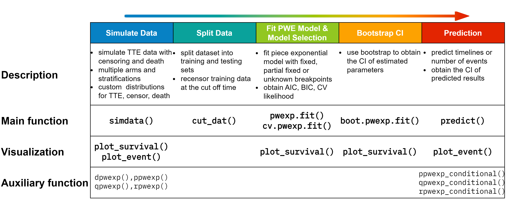
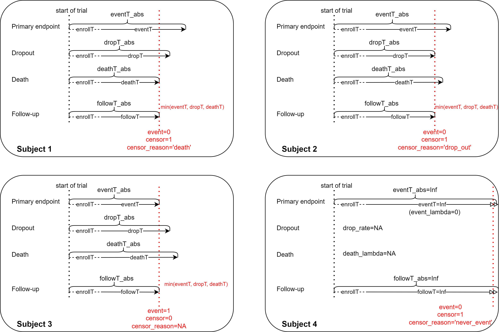
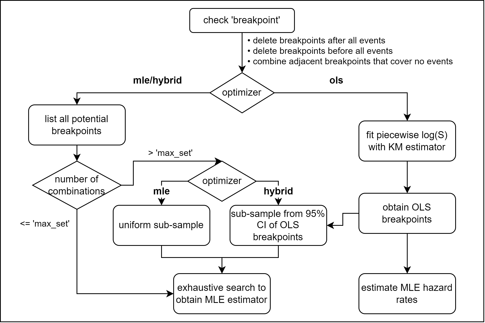

```{r setup, include=FALSE}
knitr::opts_chunk$set(echo = TRUE,
                      warning = FALSE,
                      message = TRUE,
                      fig.height = 5,
                      fig.width = 10)

library(knitr)
```

<br><br>

# Structure of Package 'PWEXP'



The `PWEXP'package provides a complete set of tools to work with
survival data with piecewise exponential distribution. It also makes
event prediction based on the fitted model. Specifically, it has five
components for different tasks:

-   **Simulate Data:** (you can skip this part if you work with an
    existing dataset)
    -   the `simdata()` function generates synthetic survival dataset
        with
        -   randomization time defined by randomization rate (number of subjects per month) or randomization
            curve (number of subjects in each month)
        -   multiple treatment groups with stratification by user-defined allocation ratio
        -   primary endpoint (event), drop-out (censor) and death with
            exponential distribution or user-defined distributions (e.g.,
            piecewise exponential, mixture distribution, etc.) for each
            stratification in each group
    -   the `plot_survival()` function plots KM estimator for the right
        censored data
    -   the `plot_event()` function plots the number of cumulative
        events
    -   auxiliary functions `dpwexp`, `ppwexp`, `qpwexp`, `rpwexp` are
        the PDF, CDF, quantile function, generator function for
        piecewise exponential distribution (See ['Piecewise Exponential
        Distribution' Section](#dist) for more details)
-   **Split Data:**
    -   the `cut_dat()` function cuts the data by a specified time
        point. Only subjects who are randomized before the specified time
        will be kept. It also recensors the data at the specified time.
        It is useful to create a training set.
-   **Fit a Piecewise Exponential Model:**
    -   the `pwexp.fit()` function fits the piecewise exponential model
        to right censored data
        -   with pre-specified breakpoints
        -   or with partially pre-specified breakpoints
        -   or with unknown breakpoints (to be fitted from the data)
    -   the `pwexp.fit()` function obtains model AIC, BIC
    -   the `cv.pwexp.fit()` conducts model cross validation and obtains the CV log likelihood
    -   the `plot_survival()` plots fitted survival curve for object
        `pwexp.fit`
-   **Bootstrap the Model to Get CI (optional):**
    -   the `boot.pwexp.fit()` conducts bootstrapping for an existing
        model
    -   the `plot_survival()` plots fitted survival curve and its CI for
        object `boot.pwexp.fit`
-   **Prediction Events and Timeline**
    -   the `predict()` function takes event model and drop-out (censor) model
        (optional) to make event prediction and timeline prediction
    -   the `predict()` function provides the CI of predicted number of events or timeline (for bootstrapping model)
    -   the `plot_event()` plots predicted number of events (for object
        `predict.pwexp.fit`) and its CI (if applicable, for object
        `predict.boot.pwexp.fit()`)
    -   auxiliary functions `ppwexp_conditional()`, `qpwexp_conditional()`, `rpwexp_conditional()` are the CDF,
        quantile function, generator function for conditional piecewise
        exponential distribution (See ['Conditional Piecewise Exponential
        Distribution' Section](#con_dist) for more details)

<br>

# 0. Install Package 'PWEXP'

You need to install package
[fastmatch](https://CRAN.R-project.org/package=fastmatch) before
installing [PWEXP](https://github.com/zjph602xtc/PWEXP).

```{r eval=FALSE}
install.packages('fastmatch')
library('fastmatch')
library('PWEXP')

# or install package from Github
install.packages("devtools")
library(devtools)
install_github("zjph602xtc/PWEXP")
```

```{r echo=FALSE, message=FALSE}
library('PWEXP')
library('RColorBrewer')
set.seed(1818)
```

<br>

# 1. Simulate Data

## 1.1 Basic Usage of `simdata()`

You can skip this part if you work with an existing dataset. Here we use
`simdata()` function to generate a simple example dataset:

-   two groups with sample size ratio 1:2 (treatment vs. control);
-   randomization curve is defined as 10 pt/month in the first 2 months and
    5 pt/month in the following 20 months;
-   the primary endpoint (event) follows an exponential distribution
    with hazard rate 0.01, 0.05 for treatment and control group;
-   the drop-out follows an exponential distribution with drop-out
    probability 3%/month (equivalently, drop-out hazard rate is
    -log(1-0.03)=0.0304) for both groups;
-   the death event follows an exponential distribution with hazard rate
    0, 0.005 for each group;
-   argument `add_column` request some extra variables.

```{r}
demo_dat0 <- simdata(group = c('trt','control'), n_rand = c(10,10,rep(5,20)),
                     allocation = c(1,2), event_lambda = c(0.01, 0.05), 
                     drop_rate = 0.03, death_lambda = c(0, 0.005), 
                     add_column = c('eventT_abs','dropT_abs','deathT_abs','followT','followT_abs','censor','event','censor_reason'))
head(demo_dat0)
```

In the generated dataset:

-   `randT` is the randomization time
-   `eventT`, `dropT`, `deathT` are the underlying primary event,
    drop-out, death time
-   `followT` is the follow-up time, which is the minimum value of
    `eventT`, `dropT`, `deathT`
-   `eventT_abs`, `dropT_abs`, `deathT_abs`, `followT_abs` are the corresponding time
    from the beginning of the trial
-   `cenosr`, `event` indicate whether the primary event happened at the
    end of follow-up; if a subject is censored, `censor_reason` shows
    the type of censoring (i.e., 'drop_out','death' or 'never_event'(when
    followT=inf)))

The diagram below shows the relationship between these variables:


<br>

## 1.2 Generate Data with User-defined Distributions

[In the follow parts of the
demonstration]{style="color: #EB6864;font-weight:bold"}, we will use a
single group with piecewise exponential distribution endpoint:

```{r}
# define the piecewiese exponential event generation function
myevent_dist <- function(n)rpwexp(n, rate=c(0.1, 0.01, 0.2), breakpoint=c(5,14))
# you can use any generation function in simdata function, for example, use a weibull density:
# myevent_dist <- function(n)rweibull(n, shape=0.5, scale=10)
# use advanced_dist to adopt user-defined distribution, see function help for more details
dat <- simdata(rand_rate = 20, total_sample = 1000, drop_rate = 0.03,  
               advanced_dist = list(event_dist=myevent_dist),
               add_column = c('censor_reason','event','followT','followT_abs'))
```

We can use the `plot_survival()` function to plot the survival curve and
cumulative number of events:

```{r figures-side, fig.show="hold", out.width="50%", out.height="100%", fig.width=5, fig.height=4}
plot_survival(dat$eventT, dat$event, conf.int = F, mark.time = T, xlim = c(0, 25), main='Survival Function of the Simu Data')
plot_event(dat$eventT, abs_time = F, dat$event, xlim = c(0, 25), main='Number of Cumulative Events of the Simu Data')
```
<br>

# 2. Split Data to Obtain Training/Interim Data

We cut the dataset by the time when 80% percent subject are randomized.
Only subjects who are randomized before the specified time will be kept in
the returned data. The returned data will be recensored at the specified
time. This step is to create a training set. In real data analysis, this
step may not be needed.

```{r}
cut <- quantile(dat$randT, 0.8)
train <- cut_dat(cut = cut, data = dat, var_randT = 'randT', 
                 var_followT = 'followT', var_followT_abs = 'followT_abs',
                 var_event = 'event', var_censor_reason = 'censor_reason')
```

<br>

# 3. Fit a Piecewise Exponential Model {#model}

We will fit several piecewise exponential models on the training set:

-   `fit_a0` has pre-specified breakpoints at time = 5, 14
-   `fit_a1` has one pre-specified breakpoint at time = 14, and the total number
    of breakpoint is 2. The other breakpoint will be estimated from the
    data
-   `fit_b0` to `fit_b4` have 0 to 4 unknown breakpoints. Note the
    `fit_b0` model is actually an exponential model since there is NO
    breakpoints.

```{r}
fit_a0 <- pwexp.fit(train$followT, train$event, breakpoint = c(5,14))
fit_a1 <- pwexp.fit(train$followT, train$event, nbreak = 2, breakpoint = c(14))
# argument 'exclude_int' defines an interval that excludes any estimated breakpoints. for example:
# fit_a1 <- pwexp.fit(train$followT, train$event, nbreak = 2, breakpoint = c(5), exclude_int=c(8,Inf))
fit_b0 <- pwexp.fit(train$followT, train$event, nbreak = 0)
fit_b1 <- pwexp.fit(train$followT, train$event, nbreak = 1)
fit_b2 <- pwexp.fit(train$followT, train$event, nbreak = 2)
fit_b3 <- pwexp.fit(train$followT, train$event, nbreak = 3)
fit_b4 <- pwexp.fit(train$followT, train$event, nbreak = 4)
```

We plot BIC of these models and find that among all  models without
pre-specified breakpoints, `fit_b2` with the correct number of
breakpoints has the lowest BIC value. We can also use cross validation
to help us choose the model. The model `fit_b2` with the correct
number of breakpoints has the highest CV log likelihood.

```{r fig.show="hold", out.width="50%", out.height="100%", fig.width=6, fig.height=5, message=FALSE, results='hide'}
library('RColorBrewer')
model_name <- c('2 fixed breakpoints', '1 fixed + 1 unknown bkp', '0 unknown bkp (exp model)', '1 unknown bkp', '2 unknown bkp', '3 unknown bkp', '4 unknown bkp')
model_ind <- c('a0','a1',paste0('b',0:4))
col <- c(brewer.pal(3, 'Pastel1')[1:2], brewer.pal(9, 'Greens')[3:7])

# Plot BIC for each model
barplot(c(fit_a0$BIC, fit_a1$BIC, fit_b0$BIC, fit_b1$BIC, fit_b2$BIC, fit_b3$BIC, fit_b4$BIC), xlab='Model', ylab='BIC', ylim=c(2700,3400), xpd=F, col=col, names.arg=model_ind, main='BIC of Fitted Models')
legend('topleft', model_name, fill=col, ncol=2, text.width=3.5)

# Cross validate fitted models
nsim <- 50
fit_a0_cv <- cv.pwexp.fit(fit_a0, nsim = nsim)
fit_a1_cv <- cv.pwexp.fit(fit_a1, nsim = nsim)
fit_b0_cv <- cv.pwexp.fit(fit_b0, nsim = nsim)
fit_b1_cv <- cv.pwexp.fit(fit_b1, nsim = nsim)
fit_b2_cv <- cv.pwexp.fit(fit_b2, nsim = nsim)
fit_b3_cv <- cv.pwexp.fit(fit_b3, nsim = nsim)
# alternatively, we can specify a new model in the cv.pwexp.fit function instead of CV a fitted model, for example:
fit_b4_cv <- cv.pwexp.fit(train$followT, train$event, nbreak=4, nsim=nsim)
boxplot(cv~model_ind, data.frame(cv=c(fit_a0_cv, fit_a1_cv, fit_b0_cv, fit_b1_cv, fit_b2_cv, fit_b3_cv, fit_b4_cv), model_ind=rep(model_ind, each=nsim)), ylab='CV log likelihood', xlab='Model', ylim=c(-320,-250), col=col, main='CV log likelihood of Fitted Models')
legend('topleft', model_name, fill=col, ncol=2, text.width=3)
```

We then plot the fitted curves of some of these models.

```{r fig.width=5,fig.height=4.5}
# Plot fitted survival curves
plot_survival(train$followT, train$event, xlim=c(0,40), main='Fitted Models with Different \nNumber of Breakpoints')
plot_survival(fit_b0, col='green', lwd=2)
plot_survival(fit_b1, col='blue', lwd=3, show_breakpoint = F)
plot_survival(fit_b2,  col='red', lwd=3, breakpoint_par = list(col='grey50', lty=2))
plot_survival(fit_b3, col='orange', lwd=3, show_breakpoint = F)
legend('topright',c('training data', '0 breakpoints','1 breakpoint','2 breakpoints','3 breakpoints'), lwd=3, col=c('black', 'green','blue','red','orange'))
```
<br>

# 4. Bootstrap Model (optional)

We will use bootstrap to estimate the uncertainty of estimated parameters. We
take model `fit_b2` as an example.

```{r fig.width=5,fig.height=4.5, message=FALSE, results='hide'}
# bootstrap the model
fit_b2_boot <- boot.pwexp.fit(fit_b2, nsim = 50)

# plot data and the fitted model with 95% CI
plot_survival(train$followT, train$event, xlim=c(0,40), main='Fitted Model for Primary Events with 95% CI')
plot_survival(fit_b2_boot, col='red', alpha=0.05, CI_par = list(col='#ff9896'))
# plot 95% CI of estimated breakpoints
brk_ci <- apply(attr(fit_b2_boot, 'brk'), 2, function(x)quantile(x,c(0.025,0.975)))
abline(v=brk_ci, col='grey', lwd=2, lty=3)
```
<br>

# 5. Prediction Future Events & Timeline

In order to do prediction, we also need to build a model for drop-out
and death (the censoring model) in addition to the event model. The
censoring model is very similar to the event model in [Section 3](#model), but the
response of the model is drop-out and death instead of the primary
events. The model is optional when the drop-out (and death) rate is very
low.

Here, `drop_indicator` is a time-to-event endpoint that represents the
time of drop-out (and we do not have death in the simulated data), and
it will be used as the response variable in the censoring model. We will
fit an exponential model with bootstrapping.

```{r fig.width=5,fig.height=4.5, message=FALSE, results='hide'}
drop_indicator <-  ifelse(train$censor_reason=='drop_out' & !is.na(train$censor_reason),1,0)
plot_survival(train$followT, drop_indicator, xlim=c(0,40), ylab='Survival function of drop-out', main='Fitted Censoring Model for Drop-out with 95% CI')
fit_censor_boot <- boot.pwexp.fit(train$followT, drop_indicator, nbreak = 0, nsim = 50)
plot_survival(fit_censor_boot, col='red', alpha=0.01, CI_par = list(col='#ff9896'))
```

Finally, we use `predict()` function to predict the number of events in the future. Note the returned object from  `predict()` contains event curve functions and it should be used in `plot_event()` function to obtain the estimated events and to plot the curve. 
```{r, message=FALSE, results='hide'}
predicted_boot <- predict(event_model_boot=fit_b2_boot, analysis_time=cut, censor_model_boot=fit_censor_boot, future_rand=list(rand_rate=20, total_sample=NROW(dat)-NROW(train)))
```

We use `plot_event()` function to plot the event curve:
```{r fig.width=5,fig.height=4.5}
plot_event(dat$followT_abs, abs_time=T, event=dat$event, ylim=c(0, 800), main='Predicted Number of Events')
plot_event(train$followT_abs, abs_time=T, event=train$event, add=T, col='blue')
pred_event <- plot_event(predicted_boot, eval_at = seq(40, 90, 5))
legend('bottomright', c('data used to train model', 'true event curve', 'predicted event curve'), lwd=2, col=c('blue', 'black', 'red'))
```

Here is the estimated number of events specified by argument `eval_at`:
```{r}
head(pred_event)
```
<br>

By adding argument `xyswitch=TRUE`, we can use `predict()` function to obtain the timeline given the number of events in the future.  
```{r fig.width=5,fig.height=4.5}
plot_event(dat$followT_abs, xlim=c(0, 800), event=dat$event, xyswitch=T, main='Predicted Timeline')
plot_event(train$followT_abs, abs_time=T, event=train$event, add=T, xyswitch=T, col='blue')
pred_time <- plot_event(predicted_boot, xyswitch=T, eval_at = seq(500, 700, 50))
legend('bottomright', c('data used to train model', 'true timeline', 'predicted timeline'), lwd=2, col=c('blue', 'black', 'red'))
head(pred_time)
```
<br>

# Appendix
## A. Distribution
### A.1 Piecewise Exponential Distribution {#dist}

The hazard function, cumulative hazard function, PDF, CDF, quantile
function of an exponential distribution r.v. $t$ are: \begin{align*}
    h(t)&=\lambda\\
    H(t)&=\lambda t\\
    f(t)&=\lambda e^{-\lambda t}\\
    F(t)&=1-e^{-\lambda t}\\
    Q(p)&=\frac{-\log(1-p)}{\lambda}
\end{align*} The hazard function, cumulative hazard function, PDF,
survival function, quantile function of a piecewise exponential
distribution r.v. $t$ with breakpoints $d_i$ are: \begin{align*}
    h(t)&=\begin{cases}
        \lambda_1, & t<d_1\\
        \lambda_2, & d_1\le t<d_2\\
        \vdots\\
        \lambda_{r+1}, & t\ge d_r
    \end{cases}\\
    H(t)&=\begin{cases}
        \lambda_1 t, & t<d_1\\
        (\lambda_1-\lambda_2)d_1+\lambda_2t , & d_1\le t<d_2\\
        \vdots\\
        \left[\sum_{i=1}^r(\lambda_i-\lambda_{i+1})d_i\right]+\lambda_{r+1}t, & t\ge d_r
    \end{cases}\\
    f(t)=h(t)e^{-H(t)}&=\begin{cases}
        \lambda_1 e^{-\lambda_1 t}, & t<d_1\\
        \lambda_2 e^{(\lambda_2-\lambda_1)d_1-\lambda_2t} , & d_1\le t<d_2\\
        \vdots\\
        \lambda_{r+1}e^{\left[\sum_{i=1}^r(\lambda_{i+1}-\lambda_{i})d_i\right]-\lambda_{r+1}t}, & t\ge d_r
    \end{cases}\\
    S(t)=e^{-H(t)}&=\begin{cases}
        e^{-\lambda_1 t}, & t<d_1\\
        e^{(\lambda_2-\lambda_1)d_1-\lambda_2t} , & d_1\le t<d_2\\
        \vdots\\
        e^{\left[\sum_{i=1}^r(\lambda_{i+1}-\lambda_{i})d_i\right]-\lambda_{r+1}t}, & t\ge d_r
    \end{cases}\\\\
    Q(p)&=\begin{cases}
        \frac{-\log(1-p)}{\lambda_1} & p< 1-e^{-\lambda d_1}\\
        \frac{(\lambda_2-\lambda_1)d_1-\log(1-p)}{\lambda_2} & 1-e^{-\lambda d_1}\le p< 1-e^{(\lambda_2-
        \lambda_1)d_1-\lambda_2 d_2}\\
        \cdots\\
        \frac{\left[\sum_{i=1}^r (\lambda_{i+1}-\lambda_i)d_i\right]-\log(1-p)}{\lambda_{r+1}} & p\ge 1-e^{\left[\sum_{i=1}^r(\lambda_{i+1}-\lambda_{i})d_i\right]-\lambda_{r+1}d_r}\\
    \end{cases}
\end{align*}

The ``PWEXP`` package provides ``dpwexp()``, ``ppwexp()``, ``qpwexp()``, ``rpwexp()`` functions to the piecewise exponential distribution:
```{r fig.show="hold", out.width="50%", out.height="100%", fig.width=6, fig.height=5.8}
# Left Figure ------------------------------------------------------------
# use rpwexp function to generate piecewise exp samples with rate 2, 1, 3
r_sample <- rpwexp(50000, rate=c(2, 1, 3), breakpoint=c(0.3, 0.8))
hist(r_sample, freq=F, breaks=200, main="Density of Piecewsie Exp Dist", xlab='t', xlim=c(0, 1.2))

# piecewise exp density with rate 2, 1, 3 
t <- seq(0, 1.5, 0.01)
f2 <- dpwexp(t, rate=c(2, 1, 3), breakpoint=c(0.3, 0.8))
points(t, f2, col='red', pch=16)

# exp distribution can be a special case of piecewise exp distribution
f1 <- dpwexp(t, rate=2) 
lines(t, f1, lwd=2)
legend('topright', c('exp dist with rate 2','piecewise exp dist with rate 2, 1, 3','histogram of piecewise exp dist with rate 2, 1, 3'), col=c('black','red'), fill=c(NA, NA, 'grey'), border=c('white', 'white', 'black'), lty=c(1, NA, NA), pch=c(NA, 16, NA), lwd=2)

# Right Figure ------------------------------------------------------------
# CDF of piecewise exp with rate 2, 1, 3
F2 <- ppwexp(t, rate=c(2, 1, 3), breakpoint=c(0.3, 0.8), lower.tail=T)
plot(t, F2, type='l', col='red', lwd=2, main="CDF and Quantile Function of Piecewsie Exp Dist", xlim=c(0, 1.5), ylim=c(0, 1.5))

# CDF of exp dist is compatible with our package
F1 <- ppwexp(t, rate=2, lower.tail=T)
lines(t, F1, lwd=2)

# plot quantile functions of both distributions
lines(F1, qpwexp(F1, rate=2, lower.tail=T), lty=2, lwd=2)
lines(F2, qpwexp(F2, rate=c(2, 1, 3), breakpoint=c(0.3,0.8), lower.tail=T), col='red', lty=2, lwd=2)

abline(0, 1, col='grey')
legend('topleft', c('CDF of piecewise exp with rate 2, 1, 3', 'quantile function of piecewise exp with rate 2, 1, 3', 'CDF of exp with rate 2', 'quantile function of exp with rate 2'), col=c('red', 'red', 'black', 'black'), lty=c(1, 2, 1, 2), lwd=2)
```

### A.2 Conditional Piecewise Exponential Distribution {#con_dist}

The conditional survival function, CDF, PFD and quantile function of an
exponential distribution $t$ given $t>T$ is \begin{align*}
    S(t|t>T)&=\frac{S(t)}{S(T)}=e^{\lambda T-\lambda t}\\
    F(t|t>T)&=1-\frac{S(t)}{S(T)}=1-e^{\lambda T-\lambda t}\\
    f(t|t>T)&=\lambda e^{\lambda T-\lambda t}\\
    Q(p|t>T)&=\frac{\lambda T-\log(1-p)}{\lambda}
\end{align*}

The conditional survival function and CDF of a piecewise exponential
distribution $t$ given $t>T$ is \begin{align*}
    S(t|t>T)&=\frac{S(t)}{S(T)}, \text{ then plug in $S(t)$, $S(T)$}\\
    F(t|t>T)&=1-\frac{S(t)}{S(T)}, \text{ then plug in $S(t)$, $S(T)$}
\end{align*} The conditional quantile function of a piecewise
exponential distribution $t$ given $t>T$ is \begin{align*}
    Q(p|t>T)=\begin{cases}
        \frac{\lambda_1 T-\log(1-p)}{\lambda_{1}}, & 
        \hspace{-60pt} p <F(d_{1}|t>T), T <d_{1}\\
        \frac{\left[\sum_{i=1}^{k-1} (\lambda_{i+1}-\lambda_i)d_i\right]+\lambda_1 T-\log(1-p)}{\lambda_{k}}, & \\
        &\hspace{-60pt} F(d_{k-1}|t>T)\le p <F(d_{k}|t>T), T <d_{1}\\
        \frac{\left[\sum_{i=m}^{k-1} (\lambda_{i+1}-\lambda_i)d_i\right]+\lambda_m T-\log(1-p)}{\lambda_{k}}, & \\
        &\hspace{-60pt} F(d_{k-1}|t>T)\le p <F(d_{k}|t>T), d_{m-1}\le T <d_{m}
    \end{cases}
\end{align*}
The ``PWEXP`` package provides ``ppwexp_conditional()``, ``qpwexp_conditional()``, ``rpwexp_conditional()`` functions for conditional piecewise exponential distribution:
```{r fig.show="hold", out.width="50%", out.height="100%", fig.width=6, fig.height=5.8}
# Left Figure ------------------------------------------------------------
# CDF and qunatile function of conditional piecewise exp with rate 2, 1, 3 given t > 0.1
t <- seq(0.1, 1.2, 0.01)
F2_con <- ppwexp_conditional(t, qT=0.1, rate=c(2, 1, 3), breakpoint=c(0.3, 0.8))
plot(t, F2_con, type='l', col='red', lwd=2, main="CDF and Quantile Function of Conditional \nPiecewsie Exp Dist", xlim=c(0, 1.2), ylim=c(0, 1.2))
lines(F2_con, qpwexp_conditional(F2_con, qT=0.1, rate=c(2, 1, 3), breakpoint=c(0.3,0.8)), lty=2, lwd=2, col='red')

# compare with CDF and quantile function of unconditional piecewise exp with rate 2, 1, 3
t <- seq(0, 1.2, 0.01)
F2 <- ppwexp(t, rate=c(2, 1, 3), breakpoint=c(0.3,0.8))
lines(t, F2, lwd=2)
lines(F2, qpwexp(F2, rate=c(2, 1, 3), breakpoint=c(0.3,0.8)), lty=2, lwd=2)
abline(v=0.1, col='grey')
abline(h=0.1, col='grey')
legend('topleft', c('CDF of piecewise exp dist given t > 0.1', 'quantile function of piecewise exp dist given t > 0.1', 'CDF of piecewise exp dist', 'quantile function of piecewise exp dist'), col=c('red', 'red', 'black', 'black'), lty=c(1, 2, 1, 2), lwd=2)

# Right Figure ------------------------------------------------------------
# use rpwexp_conditional function to generate piecewise exp samples with rate 2, 1, 3 given t > 0.1
r_sample_con <- rpwexp_conditional(3000, qT=0.1, rate=c(2, 1, 3), breakpoint=c(0.3,0.8))
plot(ecdf(r_sample_con), col='red', lwd=2,  main="Empirical CDF of Conditional Piecewsie Exp Dist", xlim=c(0, 1.2), ylim=c(0, 1))

# compare with its CDF
lines(seq(0.1, 1.2, 0.01), F2_con, lwd=2, lty=2)
legend('topleft', c('empirial CDF of piecewise exp dist given t > 0.1', 'true CDF of piecewise exp dist given t > 0.1'), col=c('red', 'black'), lty=c(1,2), lwd=2)
```
<br>

## B. Estimation of Piecewise Exponential Model
### B.1 Parameter Estimation
#### B.1.1 Hazard Rate Estimation with Known Breakpoints {#hazard}
The log likelihood function can be constructed as following:
\begin{align}
    \log(L)=&\sum_{j\in D_1}\left[\log(\lambda_1)-\lambda_1 t_j\right]+\sum_{j\in C_1}\left[-\lambda_1 t_j\right]\\
    &\quad +\sum_{j\in D_2}\left[\log(\lambda_2)+(\lambda_2-\lambda_1)d_1-\lambda_2 t_j\right]+\sum_{j\in C_2}\left[(\lambda_2-\lambda_1)d_1-\lambda_2 t_j\right]\\
    &\quad +\cdots \\
    &\quad +\sum_{j\in D_{r+1}}\left\{\log(\lambda_{r+1}) +\sum_{i=1}^r \left[(\lambda_{i+1}-\lambda_i)d_i\right]-\lambda_{r+1} t_j\right\}+\sum_{j\in C_{r+1}}\left\{\sum_{i=1}^r \left[(\lambda_{i+1}-\lambda_i)d_i\right]-\lambda_{r+1} t_j\right\}
\end{align}
where $D_r$ or $C_r$ are the index set of event time or censoring time that fall into $r$th interval of the piecewise exponential distribution.

When breakpoints $d_1$ to $d_r$ are known, we can take a derivative of $\log(L)$ wrt $\lambda$:
\begin{align}
    \frac{\partial \log(L)}{\partial \lambda_1}=&\sum_{j\in D_1}\left[1/\lambda_1- t_j\right]+\sum_{j\in C_1}\left[-t_j\right]
    +\sum_{j\in D_2}\left[-d_1\right]+\sum_{j\in C_2}\left[-d_1\right]
     +\cdots 
    +\sum_{j\in D_{r+1}}\left[-d_1\right]+\sum_{j\in C_{r+1}}\left[-d_1\right]\\
    =&\frac{n_{D_1}}{\lambda_1}-\sum_{j\in C_1}t_j- n_{2^+}d_1\\
    \frac{\partial \log(L)}{\partial \lambda_2}=&\sum_{j\in D_2}\left[1/\lambda_2+d_1-t_j\right]+\sum_{j\in C_2}\left[d_1- t_j\right]
    +\cdots
    +\sum_{j\in D_{r+1}}\left[-d_2+d_1\right]+\sum_{j\in C_{r+1}}\left[-d_2+d_1\right]\\
    =&\frac{n_{D_2}}{\lambda_2}-\sum_{j\in D_2, C_2}(t_j-d_1)- n_{3^+}(d_2-d_1)\\
    &\cdots\\
    \frac{\partial \log(L)}{\partial \lambda_r}=&\frac{n_{D_r}}{\lambda_r}-\sum_{j\in D_r, C_r}(t_j-d_{r-1})- n_{r+1^+}(d_r-d_{r-1})\\
    \frac{\partial \log(L)}{\partial \lambda_{r+1}}=&\frac{n_{D_{r+1}}}{\lambda_{r+1}}-\sum_{j\in D_{r+1}, C_{r+1}}(t_j-d_{r})
\end{align}
where $n_{D_r}$ is the number of events that fall into the $r$th interval; $n_{r^+}$ is the number of events and censoring that fall into the $r$th to the end intervals. 

Let all derivatives equal to 0, we obtain the MLE estimator of hazard rates:
\begin{align}
    \hat\lambda_1=&\frac{n_{D_1}}{\sum_{j\in C_1}t_j+ n_{2^+}d_1}\\
    \hat\lambda_2=&\frac{n_{D_2}}{\sum_{j\in D_2, C_2}(t_j-d_1)+ n_{3^+}(d_2-d_1)}\\
    &\cdots\\
    \hat\lambda_r=&\frac{n_{D_r}}{\sum_{j\in D_r, C_r}(t_j-d_{r-1})+ n_{r+1^+}(d_r-d_{r-1})}\\
    \hat\lambda_{r+1}=&\frac{n_{D_{r+1}}}{\sum_{j\in D_{r+1}, C_{r+1}}(t_j-d_r)}
\end{align}

### B.2 Estimation of Breakpoints
#### B.2.1 MLE by Brute-force Search {#mle}
The log likelihood function is differentiable wrt $d_r$ as long as $d_r$ is not equal to any event time or censoring time. We take the derivative of $\log(L)$ wrt $d_r$:
\begin{align}
    \frac{\partial \log(L)}{\partial d_r}=&\sum_{j\in D_{r+1}}\left[\lambda_{r+1}-\lambda_r\right]+\sum_{j\in C_{r+1}}\left[\lambda_{r+1}-\lambda_r\right]\\
    =&n_{r+1^+}(\lambda_{r+1}-\lambda_r)
\end{align}
Since $\lambda_{r+1}\ne \lambda_r$, then the derivative cannot be zero when $d_r$ is between two consecutive sample time points. This fact implies that only when $d_r$ is equal to any of the sample values, the log likelihood function achieves the maximum value. 

Therefore, we can use a brute-force search to calculate the log likelihood function values for all potential breakpoint combinations. For each candidate, hazard rates can be estimated by the formula in [Section B.1.1](#hazard) and thus the log likelihood can be obtained. The breakpoints and hazard rates with the largest log likelihood value are the MLE estimator. 

When the number of samples or the number of breakpoints are relatively large, the combination of breakpoints will be very large and the brute-force search may not be feasible. We will draw a random sub-sample first and then do exhaustive search based on the sub-sample. The argument \verb!max_set! in \verb!pwexp.fit()! function controls the maximum combination candidates to try. 

#### B.2.2 OLS on Survival Function {#ols}
The second method to estimate breakpoints is based on the survival curve. 
Once we take a log transformation of the piecewise survival function, we will obtain a piecewise linear function:
\begin{align}
    \log(S(t))=&\begin{cases}
        {-\lambda_1 t}, & t<d_1\\
        {(\lambda_2-\lambda_1)d_1-\lambda_2t} , & d_1\le t<d_2\\
        \vdots\\
        {\left[\sum_{i=1}^r(\lambda_{i+1}-\lambda_{i})d_i\right]-\lambda_{r+1}t}, & t\ge d_r
    \end{cases}\\
    =&-\lambda_1 t +(\lambda_1-\lambda_2) (t-d_1)_+\cdots +(\lambda_r-\lambda_{r+1})(t-d_r)_+
\end{align}

Let $Y_i$ be the log value of KM estimate at $t_i$. Following [Muggeo (2003)](#ref), we use $(t_i, Y_i)$ to fit the piecewise log survival function $\log(S(t))$ and obtain the OLS breakpoints $\hat d_r$. Once breakpoints are determined, hazard rates can be estimated by the formula in [Section B.1.1](#hazard). 

#### B.2.3 Hybrid Method
The breakpoints estimated in [Section B.2.2](#ols) are not exactly but very close to the MLE estimator. In order to obtain the MLE estimator, we combine brute-force search with OLS method. 

Specifically, instead of drawing a random sub-sample in [Section B.2.1](#mle), we draw a sub-sample from the values within 95% percent confidence intervals of the estimated breakpoints from [Section B.2.2](#ols). Then we do exhaustive search based on the sub-sample. The argument \verb!max_set! in \verb!pwexp.fit()! function controls the maximum combination candidates to try. The hybrid method improves the efficiency and accuracy of the estimation procedure.  

### B.3 Summary
The procedure of parameter estimation is summarized in the diagram below:

{width=650px}


<br> 

# Reference {#ref} 
[1] Muggeo, V. M. (2003). Estimating regression models with unknown break-points. Statistics in medicine, 22(19), 3055-3071.
