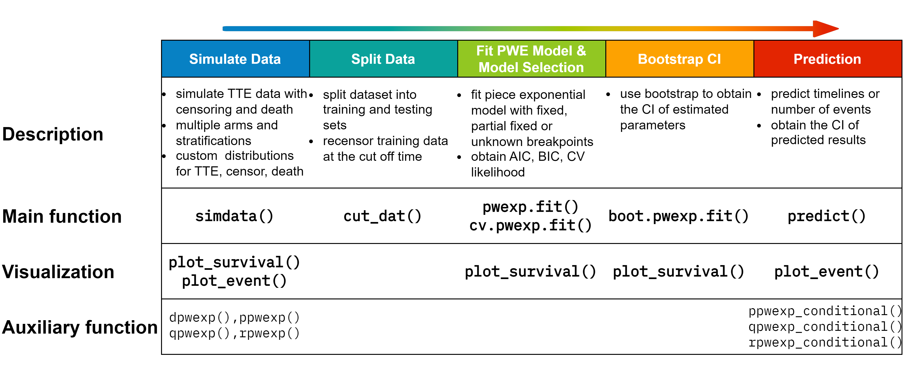

```{r setup, include=FALSE}
knitr::opts_chunk$set(echo = TRUE,
                      warning = FALSE,
                      message = TRUE,
                      fig.height = 5,
                      fig.width = 10)

library(knitr)

```
<br><br>

# 0.1. Structure of Package 'PWEXP'
The `PWEXP'package provides a complete set of tools to work with survival data with piecewise exponential distribution. It also makes event prediction based on the fitted model. Specifically, it has five components for different tasks:


* **Simulate Data:** (you can skip this part if you work with an existing dataset) 
  * the ``simdata()`` function generates synthetic survival dataset with
    * enrollment time defined by enrollment rate or enrollment curve
    * multiple treatment groups with stratification by pre-fixed allocation
    * primary endpoint (event), drop-out (censor) and death with exponential distribution or user-defined distribution (e.g., piecewise exponential, mixture distribution, etc.) for each stratification in each group
  * the ``plot_survival()`` function plots KM estimator for right censored data
  * the ``plot_event()`` function plots the number of cumulative events
  * auxiliary functions ``dpwexp``, ``ppwexp``, ``qpwexp``, ``rpwexp`` are the PDF, CDF, quantile function, generator function for piecewise exponential distribution (See 'Piecewise Exponential Distribution' Section for more details)
* **Split Data:**
  * the ``cut_dat()`` function cuts the data by a specified time point. Only subjects who are enrolled before the specified time will be kept. It also recensors the data at the specified time. It is useful to create a training set. 
* **Fit a Piecewise Exponential Model:**
  * the ``pwexp.fit()`` function fits the piecewise exponential model to right censored data
    * with pre-specified breakpoints
    * or with partially pre-specified breakpoints
    * or with unknown breakpionts (to be fitted from the data)
  * obtain model AIC, BIC
  * the ``cv.pwexp.fit()`` conducts model cross validation
  * the ``plot_survival()`` plots fitted survival curve for object ``pwexp.fit``
* **Bootstrap the Model to Get CI (optional):**
  * the ``boot.pwexp.fit()`` conducts bootstrapping of an existing model
  * the ``plot_survival()`` plots fitted survival curve and its CI for object ``boot.pwexp.fit``
* **Prediction**
  * the ``predict()`` takes event model and censor model (optional) to make event prediction and timeline prediction
  * provide the CI of predicted number of event or timeline
  * the ``plot_event()`` plots predicted number of events (for object ``predict.pwexp.fit``) and its CI (if applicable, for object ``predict.boot.pwexp.fit()``)  
  * auxiliary functions ``ppwexp_conditional()``, ``qpwexp_conditional()``, ``rpwexp`_conditional()` are the CDF, quantile function, generator function for conditional piecewise exponential distribution (See 'Conditional Piecewise Exponential Distribution' Section for more details)



<br>

# 0.2. Install Package 'PWEXP'
You need to install package [fastmatch](https://CRAN.R-project.org/package=fastmatch) before installing  [PWEXP](https://github.com/zjph602xtc/PWEXP).
```{r eval=FALSE}
install.packages('fastmatch')
library('fastmatch')
library('PWEXP')
```
```{r echo=FALSE, message=FALSE}
library('PWEXP')
```

<br>

# 1. Simulate Data
## 1.1 Basic Usage of ``simdata()``
You can skip this part if you work with an existing dataset. Here we use ``simdata()`` function to generate a simple example dataset:

* two groups with sample size ratio 1:2 (treatment vs. control);
* enrollment curve is defined as 10 pt/month in the first 2 months and 5 pt/month in the following 20 months;
* the primary endpoint (event) follows an exponential distribution with hazard rate 0.01, 0.05 for treatment and control group;
* the drop-out follows an exponential distribution with drop-out probability 3%/month (equivalently, drop-out hazard rate is -log(1-0.03)=0.0304) for both groups;
* the death event follows an exponential distribution with hazard rate 0, 0.005 for each group;
* argument ``add_column`` request some extra variables. 
```{r}
demo_dat0 <- simdata(group = c('trt','control'), n_enroll = c(10,10,rep(5,20)),
                     allocation = c(1,2), event_lambda = c(0.01, 0.05), 
                     drop_rate = 0.03, death_lambda = c(0, 0.005), 
                     add_column = c('eventT_abs','dropT_abs','deathT_abs','followT','followT_abs','censor','event','censor_reason'))
head(demo_dat0)
```
In the generated dataset:

* ``enrollT`` is the enrollment time
* ``eventT``, ``dropT``, ``deathT`` are the underlying primary event, drop-out, death time
* ``followT`` is the follow-up time, which is the minimum value of ``eventT``, ``dropT``, ``deathT``
* ``eventT``, ``dropT``, ``deathT``, ``followT`` are the corresponding time from the beginning of the trial 
* ``cenosr``, ``event`` indicator whether the primary event happen at the end of follow-up; if a subject is censored, ``censor_reason`` shows the type of censoring (i.e., 'drop_out','death' or 'never_event'(if followT=inf)))

The diagram below shows the relationship between these variables:


<br>

## 1.2 Piecewise Distribution Example
<span style="color: #EB6864;font-weight:bold">In the follow parts of the  demonstration</span>, we will use a single group with piecewise exponential distribution endpoint:
```{r}
# define the event generation function
event_dist <- function(n)rpwexp(n, rate = c(0.1, 0.01, 0.2), breakpoint =  c(5,14))
# use advanced_dist to adopt user-defined distribution
dat <- simdata(enroll_rate = 20, total_sample = 1000, drop_rate = 0.03,  
               advanced_dist = list(event_dist=event_dist),
               add_column = c('censor_reason','event','followT','followT_abs'))
```

We can use the ``plot_survival()`` function to plot the survival curve and cumulative number of events:
```{r figures-side, fig.show="hold", out.width="50%", out.height="100%", fig.width=5, fig.height=4}
plot_survival(dat$eventT, dat$event, conf.int = F, mark.time = T, xlim = c(0,25))
plot_event(dat$eventT, abs_time = F, dat$event, xlim = c(0,25))
```

# 2. Split Data to Obtain Training Set
We cut the dataset by the time when 80% percent subject are enrolled. Only subjects who are enrolled before the specified time will be kept in the returned data. The returned data will be recensored at the specified time. This step is to create a training set. In real data analysis, this step may not be needed. 
```{r}
cut <- quantile(dat$enrollT, 0.8)
train <- cut_dat(var_enrollT = 'enrollT', cut = cut, data = dat,
                 var_followT = 'followT', var_followT_abs = 'followT_abs',
                 var_event = 'event', var_censor_reason = 'censor_reason')
```

<br>

# 3. Fit a Piecewise Exponential Model
We will fit several piecewise exponential model on the training set:

* ``fit_res0`` has pre-specified breakpoints
* ``fit_res01`` has one pre-specified breakpoint 14, and the total number of breakpoint is 2. The other breakpoint will be estimated from the data
* ``fit_res1`` to ``fit_res5`` have 0 to 4 unknown breakpoints. Note the ``fit_res1`` is actually an exponential model since there is NO breakpoint. 
```{r}
fit_res0 <- pwexp.fit(train$followT, train$event, breakpoint = c(5,14), max_set = 100)
fit_res01 <- pwexp.fit(train$followT, train$event, nbreak = 2, breakpoint = c(14), max_set = 100)
fit_res1 <- pwexp.fit(train$followT, train$event, nbreak = 0, max_set = 100)
fit_res2 <- pwexp.fit(train$followT, train$event, nbreak = 1, max_set = 100)
fit_res3 <- pwexp.fit(train$followT, train$event, nbreak = 2, max_set = 100)
fit_res4 <- pwexp.fit(train$followT, train$event, nbreak = 3, max_set = 100)
fit_res5 <- pwexp.fit(train$followT, train$event, nbreak = 4, max_set = 100)
```

We plot BIC of these models and find that among the models without pre-specified breakpoints, ``fit_res3`` with the correct number of breakpionts has the lowest BIC value. We also plot the fitted curve of some of these models. 
```{r fig.show="hold", out.width="50%", out.height="100%", fig.width=6, fig.height=5}
# Plot BIC for each model
plot(c(fit_res0$BIC, fit_res01$BIC, fit_res1$BIC, fit_res2$BIC, fit_res3$BIC, fit_res4$BIC, fit_res5$BIC), type='l', lwd=2, xlab='Models', ylab='BIC')
# Plot fitted survival curves
plot_survival(train$followT, train$event, xlim=c(0,40))
plot_survival(fit_res1, col='red', lwd=2)
plot_survival(fit_res2, col='blue', lwd=3, show_breakpoint = F)
plot_survival(fit_res3,  col='green', lwd=3, breakpoint_par = list(col='grey50', lty=2))
plot_survival(fit_res4, col='orange', lwd=3, show_breakpoint = F)
legend('topright',c('0 breakpoints','1 breakpoint','2 breakpoints','3 breakpoints'), lwd=3, col=c('red','blue','green','orange'))
```
We can also use cross validation to help us choose the model. The model `fit_res3`` with the correct number of breakpionts has the highest CV log likelihood.
```{r fig.width=5,fig.height=4.5}
# Cross validate a fitted model or specify new model
fit_res1_cv <- cv.pwexp.fit(fit_res1, max_set = 100, nsim = 10)
fit_res2_cv <- cv.pwexp.fit(fit_res2, max_set = 100, nsim = 10)
fit_res3_cv <- cv.pwexp.fit(fit_res3, max_set = 100, nsim = 10)
fit_res4_cv <- cv.pwexp.fit(train$followT, train$event, nbreak = 3, max_set = 100, nsim = 10)
fit_res5_cv <- cv.pwexp.fit(train$followT, train$event, nbreak = 4, max_set = 100, nsim = 10)
boxplot(cv~nbreak, data.frame(cv=c(fit_res1_cv, fit_res2_cv, fit_res3_cv, fit_res4_cv, fit_res5_cv), nbreak=rep(0:4, each=10)), ylab='CV log likelihood')
```

# 4. Bootstrap model
We will use boostrap to estimate the uncertainty of the parameters. We take mode ``fit_res3`` as an example. 
```{r fig.width=5,fig.height=4.5}
fit_res3_boot <- boot.pwexp.fit(fit_res3, nsim = 10)
# plot data and the fitted model with 95% CI
plot_survival(train$followT, train$event, xlim=c(0,40))
plot_survival(fit_res3_boot, col='red', alpha=0.05, CI_par = list(col='#FFCCCB'))
# plot 95% CI of estimated breakpoints
brk_ci <- apply(attr(fit_res3_boot, 'brk'), 2, function(x)quantile(x,c(0.025,0.975)))
abline(v=brk_ci, col='grey', lwd=2)
```


# 1. Piecewise Exponential Distribution

The hazard function, cumulative hazard function, PDF, CDF, quantile function of an exponential distribution r.v. $t$ is:
\begin{align*}
    h(t)&=\lambda\\
    H(t)&=\lambda t\\
    f(t)&=\lambda e^{-\lambda t}\\
    F(t)&=1-e^{-\lambda t}\\
    Q(p)&=\frac{-\log(1-p)}{\lambda}
\end{align*}
The hazard function, cumulative hazard function, PDF, survival function, quantile function of a piecewise exponential distribution r.v. $t$ is:
\begin{align*}
    h(t)&=\begin{cases}
        \lambda_1, & t<d_1\\
        \lambda_2, & d_1\le t<d_2\\
        \vdots\\
        \lambda_{r+1}, & t\ge d_r
    \end{cases}\\
    H(t)&=\begin{cases}
        \lambda_1 t, & t<d_1\\
        (\lambda_1-\lambda_2)d_1+\lambda_2t , & d_1\le t<d_2\\
        \vdots\\
        \left[\sum_{i=1}^r(\lambda_i-\lambda_{i+1})d_i\right]+\lambda_{r+1}t, & t\ge d_r
    \end{cases}\\
    f(t)=h(t)e^{-H(t)}&=\begin{cases}
        \lambda_1 e^{-\lambda_1 t}, & t<d_1\\
        \lambda_2 e^{(\lambda_2-\lambda_1)d_1-\lambda_2t} , & d_1\le t<d_2\\
        \vdots\\
        \lambda_{r+1}e^{\left[\sum_{i=1}^r(\lambda_{i+1}-\lambda_{i})d_i\right]-\lambda_{r+1}t}, & t\ge d_r
    \end{cases}\\
    S(t)=e^{-H(t)}&=\begin{cases}
        e^{-\lambda_1 t}, & t<d_1\\
        e^{(\lambda_2-\lambda_1)d_1-\lambda_2t} , & d_1\le t<d_2\\
        \vdots\\
        e^{\left[\sum_{i=1}^r(\lambda_{i+1}-\lambda_{i})d_i\right]-\lambda_{r+1}t}, & t\ge d_r
    \end{cases}\\\\
    Q(p)&=\begin{cases}
        \frac{-\log(1-p)}{\lambda_1} & p< 1-e^{-\lambda d_1}\\
        \frac{(\lambda_2-\lambda_1)d_1-\log(1-p)}{\lambda_2} & 1-e^{-\lambda d_1}\le p< 1-e^{(\lambda_2-
        \lambda_1)d_1-\lambda_2 d_2}\\
        \cdots\\
        \frac{\left[\sum_{i=1}^r (\lambda_{i+1}-\lambda_i)d_i\right]-\log(1-p)}{\lambda_{r+1}} & p\ge 1-e^{\left[\sum_{i=1}^r(\lambda_{i+1}-\lambda_{i})d_i\right]-\lambda_{r+1}d_r}\\
    \end{cases}
\end{align*}


# 2. Conditional Piecewise Exponential Distribution
The conditional survival function, CDF, PFD and quantile function of an exponential distribution $t$ given $t>T$ is 
\begin{align*}
    S(t|t>T)&=\frac{S(t)}{S(T)}=e^{\lambda T-\lambda t}\\
    F(t|t>T)&=1-\frac{S(t)}{S(T)}=1-e^{\lambda T-\lambda t}\\
    f(t|t>T)&=\lambda e^{\lambda T-\lambda t}\\
    Q(p|t>T)&=\frac{\lambda T-\log(1-p)}{\lambda}
\end{align*}

The conditional survival function and CDF of a piecewise exponential distribution $t$ given $t>T$ is 
\begin{align*}
    S(t|t>T)&=\frac{S(t)}{S(T)}, \text{ then plug in $S(t)$, $S(T)$}\\
    F(t|t>T)&=1-\frac{S(t)}{S(T)}, \text{ then plug in $S(t)$, $S(T)$}
\end{align*}
The conditional quantile function of a piecewise exponential distribution $t$ given $t>T$ is 
\begin{align*}
    Q(p|t>T)=\begin{cases}
        \frac{\lambda_1 T-\log(1-p)}{\lambda_{1}}, & 
        \hspace{-60pt} p <F(d_{1}|t>T), T <d_{1}\\
        \frac{\left[\sum_{i=1}^{k-1} (\lambda_{i+1}-\lambda_i)d_i\right]+\lambda_1 T-\log(1-p)}{\lambda_{k}}, & \\
        &\hspace{-60pt} F(d_{k-1}|t>T)\le p <F(d_{k}|t>T), T <d_{1}\\
        \frac{\left[\sum_{i=m}^{k-1} (\lambda_{i+1}-\lambda_i)d_i\right]+\lambda_m T-\log(1-p)}{\lambda_{k}}, & \\
        &\hspace{-60pt} F(d_{k-1}|t>T)\le p <F(d_{k}|t>T), d_{m-1}\le T <d_{m}
    \end{cases}
\end{align*}


