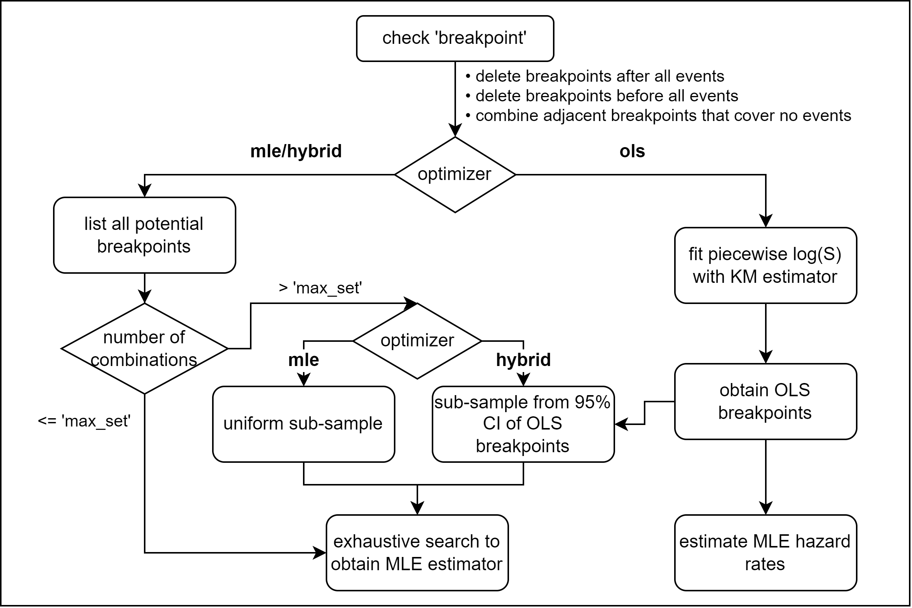

```{r setup, include=FALSE}
knitr::opts_chunk$set(echo = TRUE)
```

```{r echo=FALSE, message=FALSE, results='hide', warning=FALSE}
library('PWEXP')
library('RColorBrewer')
set.seed(1818)
```
# Distribution
## Piecewise Exponential Distribution

The hazard function, cumulative hazard function, PDF, CDF, quantile
function of an exponential distribution r.v. $t$ are: \begin{align*}
    h(t)&=\lambda\\
    H(t)&=\lambda t\\
    f(t)&=\lambda e^{-\lambda t}\\
    F(t)&=1-e^{-\lambda t}\\
    Q(p)&=\frac{-\log(1-p)}{\lambda}
\end{align*} The hazard function, cumulative hazard function, PDF,
survival function, quantile function of a piecewise exponential
distribution r.v. $t$ with breakpoints $d_i$ are: \begin{align*}
    h(t)&=\begin{cases}
        \lambda_1, & t<d_1\\
        \lambda_2, & d_1\le t<d_2\\
        \vdots\\
        \lambda_{r+1}, & t\ge d_r
    \end{cases}\\
    H(t)&=\begin{cases}
        \lambda_1 t, & t<d_1\\
        (\lambda_1-\lambda_2)d_1+\lambda_2t , & d_1\le t<d_2\\
        \vdots\\
        \left[\sum_{i=1}^r(\lambda_i-\lambda_{i+1})d_i\right]+\lambda_{r+1}t, & t\ge d_r
    \end{cases}\\
    f(t)=h(t)e^{-H(t)}&=\begin{cases}
        \lambda_1 e^{-\lambda_1 t}, & t<d_1\\
        \lambda_2 e^{(\lambda_2-\lambda_1)d_1-\lambda_2t} , & d_1\le t<d_2\\
        \vdots\\
        \lambda_{r+1}e^{\left[\sum_{i=1}^r(\lambda_{i+1}-\lambda_{i})d_i\right]-\lambda_{r+1}t}, & t\ge d_r
    \end{cases}\\
    S(t)=e^{-H(t)}&=\begin{cases}
        e^{-\lambda_1 t}, & t<d_1\\
        e^{(\lambda_2-\lambda_1)d_1-\lambda_2t} , & d_1\le t<d_2\\
        \vdots\\
        e^{\left[\sum_{i=1}^r(\lambda_{i+1}-\lambda_{i})d_i\right]-\lambda_{r+1}t}, & t\ge d_r
    \end{cases}\\\\
    Q(p)&=\begin{cases}
        \frac{-\log(1-p)}{\lambda_1} & p< 1-e^{-\lambda d_1}\\
        \frac{(\lambda_2-\lambda_1)d_1-\log(1-p)}{\lambda_2} & 1-e^{-\lambda d_1}\le p< 1-e^{(\lambda_2-
        \lambda_1)d_1-\lambda_2 d_2}\\
        \cdots\\
        \frac{\left[\sum_{i=1}^r (\lambda_{i+1}-\lambda_i)d_i\right]-\log(1-p)}{\lambda_{r+1}} & p\ge 1-e^{\left[\sum_{i=1}^r(\lambda_{i+1}-\lambda_{i})d_i\right]-\lambda_{r+1}d_r}\\
    \end{cases}
\end{align*}

The ``PWEXP`` package provides ``dpwexp()``, ``ppwexp()``, ``qpwexp()``, ``rpwexp()`` functions to the piecewise exponential distribution:
```{r fig.show="hold", out.width="50%", out.height="100%", fig.width=6, fig.height=5.8}
# Left Figure ------------------------------------------------------------
# use rpwexp function to generate piecewise exp samples with rate 2, 1, 3
r_sample <- rpwexp(50000, rate=c(2, 1, 3), breakpoint=c(0.3, 0.8))
hist(r_sample, freq=F, breaks=200, main="Density of Piecewsie Exp Dist", xlab='t', xlim=c(0, 1.2))

# piecewise exp density with rate 2, 1, 3 
t <- seq(0, 1.5, 0.01)
f2 <- dpwexp(t, rate=c(2, 1, 3), breakpoint=c(0.3, 0.8))
points(t, f2, col='red', pch=16)

# exp distribution can be a special case of piecewise exp distribution
f1 <- dpwexp(t, rate=2) 
lines(t, f1, lwd=2)
legend('topright', c('exp dist with rate 2','piecewise exp dist with rate 2, 1, 3','histogram of piecewise exp dist with rate 2, 1, 3'), col=c('black','red'), fill=c(NA, NA, 'grey'), border=c('white', 'white', 'black'), lty=c(1, NA, NA), pch=c(NA, 16, NA), lwd=2)

# Right Figure ------------------------------------------------------------
# CDF of piecewise exp with rate 2, 1, 3
F2 <- ppwexp(t, rate=c(2, 1, 3), breakpoint=c(0.3, 0.8), lower.tail=T)
plot(t, F2, type='l', col='red', lwd=2, main="CDF and Quantile Function of Piecewsie Exp Dist", xlim=c(0, 1.5), ylim=c(0, 1.5))

# CDF of exp dist is compatible with our package
F1 <- ppwexp(t, rate=2, lower.tail=T)
lines(t, F1, lwd=2)

# plot quantile functions of both distributions
lines(F1, qpwexp(F1, rate=2, lower.tail=T), lty=2, lwd=2)
lines(F2, qpwexp(F2, rate=c(2, 1, 3), breakpoint=c(0.3,0.8), lower.tail=T), col='red', lty=2, lwd=2)

abline(0, 1, col='grey')
legend('topleft', c('CDF of piecewise exp with rate 2, 1, 3', 'quantile function of piecewise exp with rate 2, 1, 3', 'CDF of exp with rate 2', 'quantile function of exp with rate 2'), col=c('red', 'red', 'black', 'black'), lty=c(1, 2, 1, 2), lwd=2)
```

## Conditional Piecewise Exponential Distribution

The conditional survival function, CDF, PFD and quantile function of an
exponential distribution $t$ given $t>T$ is \begin{align*}
    S(t|t>T)&=\frac{S(t)}{S(T)}=e^{\lambda T-\lambda t}\\
    F(t|t>T)&=1-\frac{S(t)}{S(T)}=1-e^{\lambda T-\lambda t}\\
    f(t|t>T)&=\lambda e^{\lambda T-\lambda t}\\
    Q(p|t>T)&=\frac{\lambda T-\log(1-p)}{\lambda}
\end{align*}

The conditional survival function and CDF of a piecewise exponential
distribution $t$ given $t>T$ is \begin{align*}
    S(t|t>T)&=\frac{S(t)}{S(T)}, \text{ then plug in $S(t)$, $S(T)$}\\
    F(t|t>T)&=1-\frac{S(t)}{S(T)}, \text{ then plug in $S(t)$, $S(T)$}
\end{align*} The conditional quantile function of a piecewise
exponential distribution $t$ given $t>T$ is \begin{align*}
    Q(p|t>T)=\begin{cases}
        \frac{\lambda_1 T-\log(1-p)}{\lambda_{1}}, & 
        \hspace{-60pt} p <F(d_{1}|t>T), T <d_{1}\\
        \frac{\left[\sum_{i=1}^{k-1} (\lambda_{i+1}-\lambda_i)d_i\right]+\lambda_1 T-\log(1-p)}{\lambda_{k}}, & \\
        &\hspace{-60pt} F(d_{k-1}|t>T)\le p <F(d_{k}|t>T), T <d_{1}\\
        \frac{\left[\sum_{i=m}^{k-1} (\lambda_{i+1}-\lambda_i)d_i\right]+\lambda_m T-\log(1-p)}{\lambda_{k}}, & \\
        &\hspace{-60pt} F(d_{k-1}|t>T)\le p <F(d_{k}|t>T), d_{m-1}\le T <d_{m}
    \end{cases}
\end{align*}
The ``PWEXP`` package provides ``ppwexp_conditional()``, ``qpwexp_conditional()``, ``rpwexp_conditional()`` functions for conditional piecewise exponential distribution:
```{r fig.show="hold", out.width="50%", out.height="100%", fig.width=6, fig.height=5.8}
# Left Figure ------------------------------------------------------------
# CDF and qunatile function of conditional piecewise exp with rate 2, 1, 3 given t > 0.1
t <- seq(0.1, 1.2, 0.01)
F2_con <- ppwexp_conditional(t, qT=0.1, rate=c(2, 1, 3), breakpoint=c(0.3, 0.8))
plot(t, F2_con, type='l', col='red', lwd=2, main="CDF and Quantile Function of Conditional \nPiecewsie Exp Dist", xlim=c(0, 1.2), ylim=c(0, 1.2))
lines(F2_con, qpwexp_conditional(F2_con, qT=0.1, rate=c(2, 1, 3), breakpoint=c(0.3,0.8)), lty=2, lwd=2, col='red')

# compare with CDF and quantile function of unconditional piecewise exp with rate 2, 1, 3
t <- seq(0, 1.2, 0.01)
F2 <- ppwexp(t, rate=c(2, 1, 3), breakpoint=c(0.3,0.8))
lines(t, F2, lwd=2)
lines(F2, qpwexp(F2, rate=c(2, 1, 3), breakpoint=c(0.3,0.8)), lty=2, lwd=2)
abline(v=0.1, col='grey')
abline(h=0.1, col='grey')
legend('topleft', c('CDF of piecewise exp dist given t > 0.1', 'quantile function of piecewise exp dist given t > 0.1', 'CDF of piecewise exp dist', 'quantile function of piecewise exp dist'), col=c('red', 'red', 'black', 'black'), lty=c(1, 2, 1, 2), lwd=2)

# Right Figure ------------------------------------------------------------
# use rpwexp_conditional function to generate piecewise exp samples with rate 2, 1, 3 given t > 0.1
r_sample_con <- rpwexp_conditional(3000, qT=0.1, rate=c(2, 1, 3), breakpoint=c(0.3,0.8))
plot(ecdf(r_sample_con), col='red', lwd=2,  main="Empirical CDF of Conditional Piecewsie Exp Dist", xlim=c(0, 1.2), ylim=c(0, 1))

# compare with its CDF
lines(seq(0.1, 1.2, 0.01), F2_con, lwd=2)
legend('topleft', c('empirial CDF of piecewise exp dist given t > 0.1', 'true CDF of piecewise exp dist given t > 0.1'), col=c('red', 'black'), lty=c(1,2), lwd=2)
```

# Parameter Estimation
## Hazard Rate Estimation with Known Breakpoints {#hazard}
The log likelihood function can be constructed as following:
\begin{align}
    \log(L)=&\sum_{j\in D_1}\left[\log(\lambda_1)-\lambda_1 t_j\right]+\sum_{j\in C_1}\left[-\lambda_1 t_j\right]\\
    &\quad +\sum_{j\in D_2}\left[\log(\lambda_2)+(\lambda_2-\lambda_1)d_1-\lambda_2 t_j\right]+\sum_{j\in C_2}\left[(\lambda_2-\lambda_1)d_1-\lambda_2 t_j\right]\\
    &\quad +\cdots \\
    &\quad +\sum_{j\in D_{r+1}}\left\{\log(\lambda_{r+1}) +\sum_{i=1}^r \left[(\lambda_{i+1}-\lambda_i)d_i\right]-\lambda_{r+1} t_j\right\}+\sum_{j\in C_{r+1}}\left\{\sum_{i=1}^r \left[(\lambda_{i+1}-\lambda_i)d_i\right]-\lambda_{r+1} t_j\right\}
\end{align}
where $D_r$ or $C_r$ are the index set of event time or censoring time that fall into $r$th interval of the piecewise exponential distribution.

When breakpoints $d_1$ to $d_r$ are known, we can take a derivative of $\log(L)$ wrt $\lambda$:
\begin{align}
    \frac{\partial \log(L)}{\partial \lambda_1}=&\sum_{j\in D_1}\left[1/\lambda_1- t_j\right]+\sum_{j\in C_1}\left[-t_j\right]
    +\sum_{j\in D_2}\left[-d_1\right]+\sum_{j\in C_2}\left[-d_1\right]
     +\cdots 
    +\sum_{j\in D_{r+1}}\left[-d_1\right]+\sum_{j\in C_{r+1}}\left[-d_1\right]\\
    =&\frac{n_{D_1}}{\lambda_1}-\sum_{j\in C_1}t_j- n_{2^+}d_1\\
    \frac{\partial \log(L)}{\partial \lambda_2}=&\sum_{j\in D_2}\left[1/\lambda_2+d_1-t_j\right]+\sum_{j\in C_2}\left[d_1- t_j\right]
    +\cdots
    +\sum_{j\in D_{r+1}}\left[-d_2+d_1\right]+\sum_{j\in C_{r+1}}\left[-d_2+d_1\right]\\
    =&\frac{n_{D_2}}{\lambda_2}-\sum_{j\in D_2, C_2}(t_j-d_1)- n_{3^+}(d_2-d_1)\\
    &\cdots\\
    \frac{\partial \log(L)}{\partial \lambda_r}=&\frac{n_{D_r}}{\lambda_r}-\sum_{j\in D_r, C_r}(t_j-d_{r-1})- n_{{r+1}^+}(d_r-d_{r-1})\\
    \frac{\partial \log(L)}{\partial \lambda_{r+1}}=&\frac{n_{D_{r+1}}}{\lambda_{r+1}}-\sum_{j\in D_{r+1}, C_{r+1}}(t_j-d_{r})
\end{align}
where $n_{D_r}$ is the number of events that fall into the $r$th interval; $n_{r^+}$ is the number of events and censoring that fall into the $r$th to the end intervals. 

Let all derivatives equal to 0, we obtain the MLE estimator of hazard rates:
\begin{align}
    \hat \lambda_1=&\frac{n_{D_1}}{\sum_{j\in C_1}t_j+ n_{2^+}d_1}\\
    \hat \lambda_2=&\frac{n_{D_2}}{\sum_{j\in D_2, C_2}(t_j-d_1)+ n_{3^+}(d_2-d_1)}\\
    &\cdots\\
    \hat \lambda_r=&\frac{n_{D_r}}{\sum_{j\in D_r, C_r}(t_j-d_{r-1})+ n_{{r+1}^+}(d_r-d_{r-1})}\\
    \hat \lambda_{r+1}=&\frac{n_{D_{r+1}}}{\sum_{j\in D_{r+1}, C_{r+1}}(t_j-d_r)}
\end{align}

## Estimation of Breakpoints
### MLE by Brute-force Search {#mle}
The log likelihood function is differentiable wrt $d_r$ as long as $d_r$ is not equal to any event time or censoring time. We take the derivative of $\log(L)$ wrt $d_r$:
\begin{align}
    \frac{\partial \log(L)}{\partial d_r}=&\sum_{j\in D_{r+1}}\left[\lambda_{r+1}-\lambda_r\right]+\sum_{j\in C_{r+1}}\left[\lambda_{r+1}-\lambda_r\right]\\
    =&n_{{r+1}^+}(\lambda_{r+1}-\lambda_r)
\end{align}
Since $\lambda_{r+1}\ne \lambda_r$, then the derivative cannot be zero when $d_r$ is between two consecutive sample time points. This fact implies that only when $d_r$ is equal to any of the sample values, the log likelihood function achieves the maximum value. 

Therefore, we can use a brute-force search to calculate the log likelihood function values for all potential breakpoint combinations. For each candidate, hazard rates can be estimated by the formula in [Section 2.1](#hazard) and thus the log likelihood can be obtained. The breakpoints and hazard rates with the largest log likelihood value are the MLE estimator. 

When the number of samples or the number of breakpoints are relatively large, the combination of breakpoints will be very large and the brute-force search may not be feasible. We will draw a random sub-sample first and then do exhaustive search based on the sub-sample. The argument \verb!max_set! in \verb!pwexp.fit()! function controls the maximum combination candidates to try. 

### OLS on Survival Function {#ols}
The second method to estimate breakpoints is based on the survival curve. 
Once we take a log transformation of the piecewise survival function, we will obtain a piecewise linear function:
\begin{align}
    \log(S(t))=&\begin{cases}
        {-\lambda_1 t}, & t<d_1\\
        {(\lambda_2-\lambda_1)d_1-\lambda_2t} , & d_1\le t<d_2\\
        \vdots\\
        {\left[\sum_{i=1}^r(\lambda_{i+1}-\lambda_{i})d_i\right]-\lambda_{r+1}t}, & t\ge d_r
    \end{cases}\\
    =&-\lambda_1 t +(\lambda_1-\lambda_2) (t-d_1)_+\cdots +(\lambda_r-\lambda_{r+1})(t-d_r)_+
\end{align}

Let $Y_i$ be the log value of KM estimate at $t_i$. Following [Muggeo (2003)](#ref), we use $(t_i, Y_i)$ to fit the piecewise log survival function $\log(S(t))$ and obtain the OLS breakpoints $\hat d_r$. Once breakpoints are determined, hazard rates can be estimated by the formula in [Section 2.1](#hazard). 

### Hybrid Method
The breakpoints estimated in [Section 2.2.2](#ols) are not exactly but very close to the MLE estimator. In order to obtain the MLE estimator, we combine brute-force search with OLS method. 

Specifically, instead of drawing a random sub-sample in [Section 2.2.1](#mle), we draw a sub-sample from the values within $95\%$ percent confidence intervals of the estimated breakpoints from [Section 2.2.2](#ols). Then we do exhaustive search based on the sub-sample. The argument \verb!max_set! in \verb!pwexp.fit()! function controls the maximum combination candidates to try. The hybrid method improves the efficiency and accuracy of the estimation procedure.  

## Summary
The procedure of parameter estimation is summarized in the diagram below:

{width=650px}


<br> 

# Reference {-#ref} 
[1] Muggeo, V. M. (2003). Estimating regression models with unknown break-points. Statistics in medicine, 22(19), 3055-3071.
